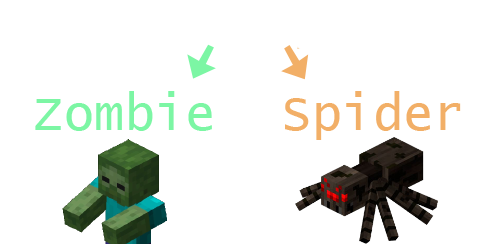

<H1>Extras: Abstract Classes</H1>
When making use of inheritance, sometimes we might want to define a type that itself should never be created.
For example, we might want to make an Enemy class, with child classes for a Zombie and Spider. 

 
In this scenario, we can create Zombie objects and Spider objects, but we can also create Enemy objects, which doesn’t make as much sense. What is an enemy, if it isn’t one of its child class objects?
In these circumstances we can use an “abstract” class.

Copy and paste the code below into a blank Processing project: 

class Enemy {
  void Move(){
    println("a generic enemy is moving");
  }
}

class Zombie extends Enemy{
  void Move(){
    println("a zombie is stumbling");
  }
}

class Spider extends Enemy{
}

void setup(){
  Enemy enemy = new Zombie();
  enemy.Move();
}


When you run the program, you should see that the console prints out "a zombie is stumbling". This is because we’re making use of polymorphism, to store a zombie object in an enemy variable (which is fine because the Zombie class extends the Enemy class). 
But with the code as it currently is, we could change the line of code where we create the enemy variable to the line below: 

Enemy enemy = new Enemy();


If we run the program with this change, we should see that the console prints out "a generic enemy is moving". The code runs perfectly, but what is a generic enemy? What does it look like? How does it move? We’ve created an object of a class that we only ever wanted to use as a parent class to define similar functionality.

This is where abstraction comes in!

 
<h2 id="creating_an_abstract_class">Creating an Abstract Class</h2>
Add the word "abstract" in front of the Enemy class declaration like below: 

abstract class Enemy {
 

You should now see that the line of code where we try to create the enemy object is giving us an error. This is because we’re trying to create an object from a class that we’ve marked as abstract, which means we only ever want to be able to create objects of classes that extend it.

To fix the code, change the enemy variable to a Spider.

 
<h2>Abstract Methods</h2>
If we run the program again, we should see that the spider object will fall back on the abstract class Move method, meaning we get "a generic enemy is moving" again in the console. But what if we decided that all enemies should be able to move, but they should always have to override the Move method, and never rely on the generic one that the Enemy class currently has? 
This is where abstract methods come in! 
Similarly to abstract classes, we can tell a method that it is also abstract, meaning child classes will have to override it, as it can't be called, in the same way that an object can't be created from an abstract class. 
To make the Move method abstract, we can again just add the abstract keyword in-front of it: 

abstract void Move(){
 
This will give us an error, because the Spider class isn't overriding the Move method!

<h3>Task</h3>
<blockquote>Override the Move method in the Spider class, so that it prints out "a spider climbs the walls"</blockquote> 

The program should now run happily!

  <video width="600" controls style="max-width: 100%;">
    <source src="{{ site.baseurl }}/Videos/Abstraction.mp4" type="video/mp4">
    Your browser does not support the video tag.
  </video>

 

 
<h2>Summary</h2>
Abstraction offers us a way to define whether we want a class to not be creatable, so that we can have parent classes that don’t have to fill out all of the functionality that their child classes should contain, making our code more robust for extending it in the future!

 
<h2>Project Files</h2>
To download the completed project files for this extras page, <a href="{{ site.baseurl }}/ProcessingFiles/Extras/AbstractClass.zip" target="_blank">click here</a>. Make sure to extract the files from the zip before trying to open them!
 

<h2>More Help</h2>
<ul>
    <li><h3><a href="https://www.w3schools.com/java/java_abstract.asp" target="_blank">Abstraction example</a></h3></li>
</ul>
 

