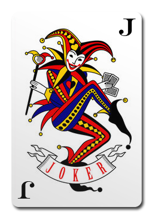

<h1>Hypotheses</h1>

Depending on what your findings are when you conduct an experiment, you will be able to accept or reject the null hypothesis. You will ultimately therefore be able to select on of your hypotheses as the most likely to align with reality.

For example, you get 90 participants to select a card from a deck of 52 cards, and report how surprised they are by the outcome on a scale from 1-5. The deck is made up completely of Jokers. You tell a third of the participants (Group A) that there are Jokers in the deck. You tell another third (Group B) that there are no Jokers in the deck. You do not tell the final third of participants (Group C) anything about Jokers. You compare results between the three groups.
 
You form four possible outcomes into some basic hypotheses:
 

Interactions with the participants could have no effect on their feeling of being surprised: 

<blockquote style="font-size:20px"><b>H0</b>: Telling participants about whethere there is a Joker in the cards does not change how surprised they are. </blockquote> 

Participants that are told about the Jokers expect one to appear, therefore: 
<blockquote style="font-size:20px"><b>H1</b>: Participants that know that a Joker may appear report the lowest levels of surprise upon finding one. </blockquote> 

Being told that no Jokers are in the deck may make participants think that they are being tricked, leading them to expect a Joker:
<blockquote style="font-size:20px"><b>H2</b>: Participants that are told that there are not Jokers in the deck report the lowest levels of surprise upon finding one. </blockquote> 

Or finally, informing participants about the contents of the deck may lead to expected outcomes, whilst telling them nothing does not, therefore:
<blockquote style="font-size:20px"><b>H3</b>: Participants that are not told anything about the deck report the lowest levels of surprise upon finding a Joker. </blockquote> 
 
 
Upon conducting your experiment and analysis, you find that the Group C report the lowest levels of surprise out of the three groups. 

You would therefore be able to select <b>H3</b> as the correct hypothesis, based on the collected evidence.

