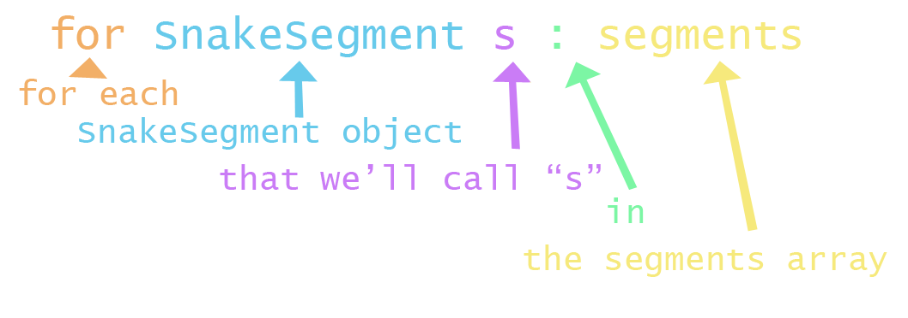

<h1>Chapter 7: Loops</h1>

In this chapter, we'll be covering how to loop over sections of code so that we can repeat instructions.
 
For a quick reference, <a href="../QuickReference/Loops">click here</a>.
 

<h2>The Problem</h2>
You may have realised that there’s quite a lot of repetition in the code we added in the last chapter, with only minor changes at each step. If we wanted to make our snake ten segments long for example, we’d be duplicating code in the draw and move methods seven more times, which isn’t ideal!

To handle situations like this, we can use loops to make our code much easier to read and write!

 
<h2  id="while_loops">While Loops</h2>
To get used to loops, open up a blank project and copy and paste in the code below:


int i = 0;
while( i < 10 ){
  println(i);
  i = i+1;
}

 

When you run the code in the above example, you should see that the numbers from 0 to 9 are printed into the console.
The while loop in the example uses exactly the same format as an if statement, in that it takes in a condition, and runs the code inside its curly brackets when that condition is true. The difference being that a while loop will run the code inside it, repeatedly, until the condition is false.
This can cause issues, so make sure that the logic in your loop always allows for your loop to end eventually!

In the example, the condition x<10 is true until x reaches a value of 10, which it does because on each “iteration” going through the loop, the value inside x is increased by 1.

 

  <video width="600" controls style="max-width: 100%;">
    <source src="{{ site.baseurl }}/Videos/WhileLoops.mp4" type="video/mp4">
    Your browser does not support the video tag.
  </video>

 

While loops are useful when we don’t know exactly how long we need to repeat something for, which isn’t the case in this example, so what might be a better option?

 
<h2  id="for_loops">For Loops</h2>
A for loop is a while loop with some quality-of-life features!
If we look back at the while loop, we can see that there are three key things the loop made use of, plus the code to run itself:
<li>A variable to track what iteration we’re on:</li> 

`int i = 0;`

<li>The condition for which the loop should keep running:</li>

`( i < 10 )`

<li>An increment to make sure x reaches its target value:</li>

`i = i+1;`

<li>and the code we actually want to run:</li>

`println(i);`

A for loop allows us to fold the first three of these into a single line of code, so that we can focus on the code we actually want to run!
In the example below, the while loop has been translated into a for loop, keeping its functionality exactly the same:


for(int i = 0; i < 10; i = i+1){
  println(i);
}

 

The format of for loops can be a little tricky to remember at first, but it’s ultimately just remembering those three core parts of the loop, with a semicolon breaking up each one from the next, and that’s the information we’re passing in to the for loop round brackets.

<h3>Important!</h3>
The section of the for loop used for increasing the i variable is run **_AFTER_** the main block of code inside the curly brackets. This means that if we’re using i in this code, it may be one less than the number you might expect!

 

  <video width="600" controls style="max-width: 100%;">
    <source src="{{ site.baseurl }}/Videos/ForLoops.mp4" type="video/mp4">
    Your browser does not support the video tag.
  </video>

 

 
<h2  id="putting_it_into_practice">Putting it into Practice</h2>
Looking back at the Snake project, we can see some lines of code that get repeated with only minor changes. The Snake class constructor for example, repeats lines of code that initialise each element of the array.
Instead of initialising the elements individually, we can do them all together using a for loop. Each line initialising elements in the array is only different in the element number used to access the array, so we can use the variable we’re using the keep count of what loop we’re up to.

<h3>Task</h3>
<blockquote>
In the Snake class constructor, write a for loop following the example above. The loop should run as long as the counter variable (in the example this was 'i') is less than 3 (the size of the snake). The code inside the curly brackets should initialise element 'i' in the array with a new SnakeSegment object as before.

 
Once that’s done, delete the old code used to initialise the array elements, and we should be good!
</blockquote>
 

A small change we can make to our code at this point to make it more expandible, is to change the 3 used in the for loop to a variable that holds the size of the array, so if we change that in the future, we don’t have to edit our code!

Thankfully arrays have a built-in variable called "length" that we can use for this purpose, so replace the 3 in the for loop with "segments.length".

Make sure to follow along in the video below to make sure you’ve got everything right!

  <video width="600" controls style="max-width: 100%;">
    <source src="{{ site.baseurl }}/Videos/UsingAForLoop.mp4" type="video/mp4">
    Your browser does not support the video tag.
  </video>

 

 
<h2  id="looping_backwards_through_an_array">Looping Backwards Through an Array</h2>
To move the snake using a for loop, we can remove the duplicated code that moves backwards through the second and third elements of the array, and instead write a for loop that sets each segments position to the position of the element one lower in the array.

To move backwards through an array, we just need to set the starting value in the for loop to the number we want to start at, and decrease it each time the loop runs.

<h3>Task</h3>
<blockquote>
<li>Add a for loop at the top of the Snake’s Move method, that initialises its counter variable to segments.length-1 (the final element in the array is always at an index one less than the size of the array!).</li>

<li>The loop should run as long as the counter is GREATER THAN OR EQUAL TO 1 (we don’t want to run this code on the snake’s head which is element 0).</li>

<li>And finally, the counter variable should be set to its previous value minus 1.</li>
</blockquote>

 
Make sure to follow along with the video below if you’re not sure how to get this working!

 

  <video width="600" controls style="max-width: 100%;">
    <source src="{{ site.baseurl }}/Videos/LoopingBackwards.mp4" type="video/mp4">
    Your browser does not support the video tag.
  </video>

 

 
<h2  id="enhanced_for_loops">Enhanced For Loops</h2>

Finally, we need to update the Draw method in the Snake class to loop over each segment, calling its own Draw method.
We could write another for loop to handle this as we did before. Feel free to give this a go to practice constructing one!

Instead of using counter variables for looping through our array, when we want to loop through every element, we can use an “enhanced for loop”. These types of loops are good in these specific cases, but aren’t useful for looping in places where we need a specific number to be used in the rest of the code (like printing i).

The format of an enhanced for loop is a little different to the standard for loop, so make sure you take some time to understand both!


for(SnakeSegment s : segments){
//code to loop here
}


This can be separated into four parts, which read as: “`For each SnakeSegment` `that we’ll call "s"` `in` `segments`”, the breakdown of which is shown below:

 

Because we’re referring to each SnakeSegment as "s", we can then write code that makes use of this variable, as if it was each element of the segments array!

Our Draw Method for the snake would therefore include the following code:


for(SnakeSegment s : segments){    
  s.Draw();
}


In this code, we’re access the position of each SnakeSegment in the segments list, and drawing a rectangle using the segment’s x and y, and the size variable from the main tab, as we did when we weren’t using a for loop.

Watch along with the video below to make sure you understand how to use an enhanced for loop!

 

  <video width="600" controls style="max-width: 100%;">
    <source src="{{ site.baseurl }}/Videos/ForEachLoops.mp4" type="video/mp4">
    Your browser does not support the video tag.
  </video>

 

 
<h2 id="snake_video">Snake Game: Part 7</h2>
To see why using loops is useful, we can test everything’s working by changing the initial size of our array to a larger number like 10. Try this out and you should see that the loops handle the additional elements of the array without any problems!

  <video width="600" controls style="max-width: 100%;">
    <source src="{{ site.baseurl }}/Videos/SnakePart7.mp4" type="video/mp4">
    Your browser does not support the video tag.
  </video>

 
<h2>Quick check!</h2>
Before you move on, let's have a quick check that you've got everything so far!

    <h3>Which of the following statements is incorrect?</h3>
    <form id="quizForm">
        <input type="radio" id="option1" name="answer" value="A" data-feedback="Correct! A while loop won't run at all if the condition isn't met immediately! But this isn't the only correct answer...">
        <label for="option1">If the condition in a while loop is not met immediately it will still run once.</label> 
        <input type="radio" id="option2" name="answer" value="B" data-feedback="Correct! The incrementation step in a for loop happens after the code block is run! But this isn't the only correct answer...">
        <label for="option2">The incrementation step in a for loop happens before any of the code is run.</label> 
        <input type="radio" id="option3" name="answer" value="C" data-feedback="Correct! An enhanced for loop can only be used in cases where you're not changing the array that you're looping over, only working with the items in the array! But this isn't the only correct answer...">
        <label for="option3">When using an enhanced for loop, you can freely change the size of the array you are looping over.</label> 
        <input type="radio" id="option4" name="answer" value="D" data-feedback="That's correct! Select each other option to see why they're wrong!">
        <label for="option4">All of the above.</label>  
        <button type="button" onclick="checkAnswer('.question1container')">Submit</button>

    </form>

    <h3>Which of these for loops is formatted correctly to run 100 times?</h3>
    <form id="quizForm">
        <input type="radio" id="option21" name="answer" value="A" data-feedback="That's not quite right, the variable i isn't initialised as it's missing the int type!">
        <label for="option21">for(i = 0; i<100; i=i+1){ //code }</label> 
        <input type="radio" id="option22" name="answer" value="B" data-feedback="That's correct! This for loop is formatted correctly!">
        <label for="option22">for(int i = 0; i<100; i=i+1){ //code }</label> 
        <input type="radio" id="option23" name="answer" value="C" data-feedback="That's not quite right, this loop would run 101 times, because it starts at 0, and runs up to and including 100, because the loop condition uses <= instead of just <!">
        <label for="option23">for(int i = 0; i<=100; i=i+1){ //code }</label> 
        <input type="radio" id="option24" name="answer" value="D" data-feedback="That's not quite right! The for loop only needs a semicolon between its three sections, not including the end!">
        <label for="option24">for(int i = 0; i<100; i=i+1;){ //code }</label>  
        <button type="button" onclick="checkAnswer('.question2container')">Submit</button>
  

    </form>

    <h3>What would the value of the variable 'sum' be after the following code has run? 
Feel free to use Processing to figure this out!</h3>
<blockquote>
int sum = 0; 
for(int i = 1; i <= 3; i=i+1){ 
	sum = sum+i; 
}
</blockquote>
    <form id="quizForm">
        <input type="radio" id="option31" name="answer" value="A" data-feedback="That's not quite right, feel free to try out the code in Processing, and print out the value of sum at the end!">
        <label for="option31">0</label> 
        <input type="radio" id="option32" name="answer" value="B" data-feedback="That's not quite right, feel free to try out the code in Processing, and print out the value of sum at the end!">
        <label for="option32">3</label> 
        <input type="radio" id="option33" name="answer" value="C" data-feedback="That's correct! The loop runs three times, and after each adds the value of i to sum, forming 0+1+2+3, which is 6!">
        <label for="option33">6</label> 
        <input type="radio" id="option34" name="answer" value="D" data-feedback="That's not quite right, feel free to try out the code in Processing, and print out the value of sum at the end!">
        <label for="option34">10</label>  
        <button type="button" onclick="checkAnswer('.question3container')">Submit</button>
  

    </form>

 

 
<h2>Summary</h2>
This chapter covers the use of three different types of loops. Make sure to go back over the chapter if you're unsure at all on how to implement any of the content we've covered.

 
<h2>Project Files</h2>
To download the completed project files for this chapter, <a href="{{ site.baseurl }}/ProcessingFiles/Chapter7_Loops.zip" target="_blank">click here</a>. Make sure to extract the files from the zip before trying to open them!
 

<h2>Extension Task</h2>
You don't need to complete this to move on, but feel free to be get creative!
<blockquote>
Adapt your background code to include a checkerboard using the size variable, and two for loops, <a href="https://youtu.be/4JzDttgdILQ?si=YYYouyZvJypIgFSZ&t=11088" target="_blank">one inside the other</a>!
</blockquote>

 
<h2>Explore</h2>
<ul>
    <li><h3><a href="https://www.javatpoint.com/java-do-while-loop" target="_blank">What if I want to make sure that my code runs at least once, and then loops if a condition is met?</a></h3></li>
    <li><h3><a href="https://youtu.be/4JzDttgdILQ?si=YYYouyZvJypIgFSZ&t=11088" target="_blank">What if I want to loop over something multiple times?</a></h3></li>
</ul>

<h2>More Help</h2>
<ul>
    <li><h3><a href="https://youtu.be/4JzDttgdILQ?si=soV2gWpxjH3w9lfB&t=10195" target="_blank">While loops</a></h3></li>
    <li><h3><a href="https://youtu.be/4JzDttgdILQ?si=Efxv5Zb0-mKBmiwa&t=10811" target="_blank">For loops</a></h3></li>
    <li><h3><a href="https://youtu.be/4JzDttgdILQ?si=3nkEAQP3S8aB-rYU&t=17661" target="_blank">Enhanced for loops</a></h3></li>
</ul>
 

<a href="./arraylists">Chapter 8 >></a>

 
 
 

	