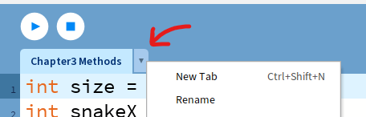
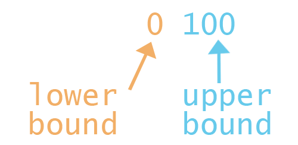

<h1>Chapter 4: Classes</h1>

In this chapter, we'll be covering how to create and use our classes to package together related variables and methods.
 
For a quick reference, <a href="../QuickReference/classes">click here</a>.
 

<h2>The Problem</h2>
We now have multiple method calls and variables relating to the snake and the apple, and any more variables relating to extending the snake and changing the position of each segment are going to end up making the main flow of code harder and hard to read.

<i>There must be a better way!</i>

We can bundle up our code relating to the snake and the apple, so that each one can hold all of the information and methods relating to itself, rather than them just being in the main flow of code.

<h2 id="object_oriented_programming">Object-Oriented Programming</h2>
Object-Oriented Programming (or OOP) is a programming model, where we group together data and the functionality related to it (in the form of variables and methods), into `objects`.

An `object` can therefore be used to represent anything we need, whether that's something tangible (such as a snake, an apple, a person, a car, a house, etc) or intangible (a game manager, a booking system, a student record).

Objects are stored in memory, in exactly the same way that we can store numbers, letters, true/false values or sentences, using variables. This not only means we can create objects in largely the same way that we create normal variables, but it means we can have multiple objects of the same type (we'll be using this have multiple sections of the snake later!).

A custom object won't fit into the same space in memory as a number or letter however, and we instead need to define the type of variable that the object is, by creating a class. In the class we can declare variables and methods, and this will act as the template for objects of that type. An object will also refer back to the class so that it can run the code in any methods that get called for them.

Using OOP, we can:
<ul>
<li>Create a Snake class</li>
<li>Create a snake object using the Snake class</li>
<li>Tell the snake object to move by calling a method in the snake class</li>
<li>Tell the snake object to be drawn to the screen by calling a method in the snake class</li>
</ul>

 

  <video width="600" controls style="max-width: 100%;">
    <source src="{{ site.baseurl }}/Videos/ObjectOrientedProgramming.mp4" type="video/mp4">
    Your browser does not support the video tag.
  </video>

 

<h2 id="creating_a_class">Creating A Class</h2>

To turn our snake and apple into objects, we first need to create a “class” for each one. A class is a template for the type of object that it defines, and this type can be used just like the types we used to create variables earlier! So let’s create a class to define what a snake **_is_**.

<h3>New Class, New Tab</h3>
To keep everything tidy, let’s create a new tab in Processing for each class we make. You can create a new tab by clicking the button here:

Select New Tab, then name the tab “**_Snake_**”

New tabs are simply for readability, as the code will be treated like it is all in one file when we run it, but in many programming languages, classes need to be created in new files, so we’ll do the same here!

In the new file, copy and paste the code below: 

class Snake{
//class variables and methods here
}


This follows a structure of:
<blockquote style="font-size:20px">
class TYPE{ 
  //class variables and methods here 
}
</blockquote>
- where the type is the name of the class.

Again, we’re seeing the curly brackets be used to bundle code together in scope, in this case, to relate all of the code about our snake together. A class can't be run in the way that a method can, as it is a definition of a structure, rather than a list of instructions, which is why we don't need round brackets to pass in information. We can pass in information when we create an object of our class type, but we'll get to that later!

<h3>Task</h3>
<blockquote>
Move all of the code related to the snake inside the curly brackets in the snake tab.
This should include the snakeX and snakeY variables, and the DrawSnake and MoveSnake methods. This will cause errors in your main tab, but we’ll fix those soon!
</blockquote>

 

  <video width="600" controls style="max-width: 100%;">
    <source src="{{ site.baseurl }}/Videos/CreatingAClass.mp4" type="video/mp4">
    Your browser does not support the video tag.
  </video>

 

 
<h2 id="initialising_class_objects">Initialising Class Objects</h2>
Now that we have a snake class, this can act as the template for a snake object. To create one of these, we need to create a snake object in the same way that we created int variables earlier.

<blockquote style="font-size:20px">
TYPE NAME = VALUE;
</blockquote>

In this case, our type is Snake, spelled just like our class. The name of the variable can be any variable name as described in chapter 1, so for simplicity, we’ll call it snake, all lowercase, so that it doesn’t conflict with the class name.

The value for a new object then follows the format of
<blockquote style="font-size:20px">
new TYPE()
</blockquote>

So, all together, to create our snake, we can use the format:

<blockquote style="font-size:20px">
TYPE NAME = new TYPE();
</blockquote>

Translating this to actual code, we can write: 

Snake snake = new Snake();


Paste the above line of code into the main tab with the apple variable declarations at the top.
When the program is run, a snake object will be created, but it won’t do anything.

In the draw method, where we previously had DrawSnake and MoveSnake, add the code below: 

snake.DrawSnake();
snake.MoveSnake();


Because we created the snake object, we can now access the methods and variables inside by using a full stop after the object’s name, then typing the variable or method name we’d like to use.

<h3>Task</h3>
<blockquote>
<ul>
<li>Create a class called Apple</li>
<li>Move the DrawApple method and appleX and appleY variables into the Apple class</li>
<li>Create an Apple object called apple</li>
<li>Call the DrawApple method from inside the draw method in the main tab</li>
</ul>
</blockquote>

 

  <video width="600" controls style="max-width: 100%;">
    <source src="{{ site.baseurl }}/Videos/CreatingAndAccessingObjects.mp4" type="video/mp4">
    Your browser does not support the video tag.
  </video>

 

<h3>Refactoring</h3>
Now that we have all of the code for the apple and snake moved inside their classes, we can change the variable names to make them a little more straightforward. Editing your code to make it more readable and more performant is called refactoring, so let’s do that!

<h3>Task</h3>
<blockquote>
Go through your code and rename variables such as snakeX and snakeY to x and y. Variables in different classes can share the same name because they don't share scope! 

You can also rename your DrawSnake and MoveSnake methods to Draw and Move, and the same for the DrawApple method in the Apple class. This will mean that wherever you’re using those variables and method names you’ll need to make sure the names match!
</blockquote>

 

  <video width="600" controls style="max-width: 100%;">
    <source src="{{ site.baseurl }}/Videos/RefactoringVariableNames.mp4" type="video/mp4">
    Your browser does not support the video tag.
  </video>

 

 
<h2 id="constructors">Constructors</h2>
When creating a new apple, it would be useful to define where it should be created instead of using the default values.

For this, we could set up its *x* and *y* values after we’ve created it, but remembering to have to do that every time wouldn’t be ideal.

<i>There must be a better way!</i>

You may have noticed that the value used when creating a new object...
<blockquote style="font-size:20px">
new NAME();
</blockquote>
...looks very similar to calling a method:
<blockquote style="font-size:20px">
NAME();
</blockquote>

This is because creating a new object also runs a method, which is known as the constructor.

By default, the constructor will just create the object, but we can define custom constructors to add in custom code that we want to run when the object is created.

To create a custom constructor for the Apple class, paste the code below inside the class. 

Apple(){ 
//object setup code here 
}


Constructors look like methods that use the class name as the type, and don’t have a custom name:

<blockquote style="font-size:20px">
TYPE(){ 
	//CODE 
}
</blockquote>

<h3>Task</h3>
<blockquote>
Inside the curly brackets of the Apple constructor, add some code to change the x and y variables to 520, and 280.
</blockquote>

 

  <video width="600" controls style="max-width: 100%;">
    <source src="{{ site.baseurl }}/Videos/Constructors.mp4" type="video/mp4">
    Your browser does not support the video tag.
  </video>

 

Running the program should now show the apple in a different starting position, but this still isn’t quite what we want. If we wanted the apple to spawn in a different starting position, we’d need to provide different numbers in the constructor, which again would just be hardcoding in values.

<i>There must be a better way!</i>

 
<h2 id="passing_parameters">Passing Parameters</h2>
It would be good if we could pass information into the constructor, in exactly the same way that we pass values in to the `background`, `size`, `rect` or `println` methods. To do this, we need to declare local variables called “parameters” inside the round brackets of our constructor (we can do exactly this for other methods too!) and make use of the variables, as if they already had values in them. When we call the constructor by initialising the object, we’ll then need to pass in matching information (of the right type!) to create the object.

Edit the Apple constructor, so that it looks like the line of code below: 

Apple(int startX, int startY){


You should then be able to adapt your code, to assign the values in startX and startY to the x and y variables, in the same way that you assigned 520 and 280 to them.

When we create parameters for a method, they can be of any datatype, even other classes!

All together, the Apple constructor should look like this: 

Apple(int startX, int startY){
	x = startX;
	y = startY;
}


Creating the apple variable back in the main tab will now need you to enter values inside the round brackets, just like we did for background, size and rect. As we’re just passing in information, we don’t need to declare the variable’s type or name, just pass in the value to be used on the other side. At this point, let’s put the apple back where it was originally, this should look like this: 

Apple apple = new Apple(400,200);


<h3>Task</h3>
<blockquote>
Create a constructor for the snake class that takes in values that can be stored in the x and y variables.
</blockquote>

When we run the code, we should see that the program looks largely the same as it did at the beginning of this chapter, but our code is now much more split up, making the main tab a lot cleaner.

 

  <video width="600" controls style="max-width: 100%;">
    <source src="{{ site.baseurl }}/Videos/ParameterPassing.mp4" type="video/mp4">
    Your browser does not support the video tag.
  </video>

 

 
<h2 id="adding_randomness">Adding Randomness</h2>
Having the apple in our snake game spawn in the same place every time isn't very useful, so let's add some randomness.

In Processing we can do this by making use of the `random` function. We'll cover functions more in the future, but they are ultimately just methods that return a value. In this case, we can pass in an upper and lower bound, and the random function will return a random value within these bounds.

As a test, paste the code below into your setup method:

println( random(0,100) );

 

Running your code multiple times should put different numbers between 0 and 100 in the console!

<h3>Note</h3>
<blockquote>Whilst the random function is a method call, in the above example, it's being used inside the print method because it returns a value. This means that it doesn't need another semicolon, as it's already inside a line with an instruction that ends with a semicolon!</blockquote>

<h3>Casting</h3>
You may have noticed that the numbers returned by the random function aren't whole numbers. This is a problem, as if we want to pass random numbers into the constructor for the apple, they need to be integers to match the constructor parameters. Thankfully, we can convert numbers with decimal numbers into integers, using a technique called "casting". To cast a number to an integer, we just need to put "(int)" in-front of it.

As a test, change the previous test code in your setup method to include the (int) like this:

println( (int) random(0,100) );

 

Running the program should now mean that the number printing out in the console is a whole number!

 

  <video width="600" controls style="max-width: 100%;">
    <source src="{{ site.baseurl }}/Videos/RandomAndCasting.mp4" type="video/mp4">
    Your browser does not support the video tag.
  </video>

 

<h3>Putting It Together</h3>
As we don't just want to spawn our apple in a random position when the program starts (but also when it gets eaten later!), we can make a method called "RespawnApple" that re-creates the apple object at a random location, and use that in the setup method for now.

Paste the code below into your main tab, below all of your other code:

void RespawnApple(){
  apple = new Apple(400,200);
}

 

Note how we're not declaring a new type for the apple variable, because we aren't creating it at this point, we're only assigning a new value into it. This is exactly the same as saying x = 3, instead of int x = 3, when just wanting to update the value.

<li>Add in a call to RespawnApple in the setup method, somewhere after the size method call.</li>

We can now replace the 400 and 200 with some maths, so make sure we have a random number for each that conforms to the spacing we want in the snake game. To do this, we're going to make use of some in-built variables called "width" and "height", which store the width and height of the canvas in pixels. We're going to divide the canvas up based on the size command, so that the apple conforms to a grid of possible positions, randomise the position within that grid, then multiply by size to get back to our original coordinate system.
Replace the line of code inside the RespawnApple method with the following code:


int gridWidth = width/size;
int gridHeight = height/size;
int gridX = (int)random(0,gridWidth);
int gridY = (int)random(0,gridHeight);

int finalX = gridX * size;
int finalY = gridY * size;

apple = new Apple(finalX,finalY);

 

You don't need to understand this code fully to continue, but it would be good to understand it so that you can build up code like this on your own. Make sure to watch the video below to follow along with how it was constructed if you're unsure.

If you've added in the method call correctly, you should now see that every time we restart the game, the apple starts in a random location.

 

  <video width="600" controls style="max-width: 100%;">
    <source src="{{ site.baseurl }}/Videos/PlacingTheApple.mp4" type="video/mp4">
    Your browser does not support the video tag.
  </video>

 

<h2>Quick check!</h2>
Before you move on, let's have a quick check that you've got everything so far!

    <h3>What are classes used for?</h3>
    <form id="quizForm">
        <input type="radio" id="option1" name="answer" value="A" data-feedback="That's not quite right, classes are useful for grouping together related variables, but they can also group together methods!">
        <label for="option1">Grouping variables together, but not methods.</label> 
        <input type="radio" id="option2" name="answer" value="B" data-feedback="That's correct! Classes act as templates for 'objects', and can group together variables and methods to do this!">
        <label for="option2">Grouping variables and methods together, as a template for 'objects'.</label> 
        <input type="radio" id="option3" name="answer" value="C" data-feedback="That's not quite right, classes are useful for grouping together variables and methods, but this shouldn't just be so that they're out of the way.">
        <label for="option3">Grouping variables and methods together so that they're out of the way.</label> 
        <input type="radio" id="option4" name="answer" value="D" data-feedback="That's not quite right, methods group together lines of code we want to run, whereas classes group together variables and methods to define objects.">
        <label for="option4">The same as methods.</label>  
        <button type="button" onclick="checkAnswer('.question1container')">Submit</button>

    </form>

    <h3>Which of these lines of code would correctly create an empty class called "GameManager"?</h3>
    <form id="quizForm">
        <input type="radio" id="option1" name="answer" value="A" data-feedback="That's not quite right, whilst a class definition can include methods to be run, the class itself doesn't run, so it doesn't need the round brackets for passing in information at this point!">
        <label for="option1">class GameManager(){ }</label> 
        <input type="radio" id="option2" name="answer" value="B" data-feedback="That's correct! The class name is used with curly brackets to define the scope of the included variables and methods.">
        <label for="option2">class GameManager{ }</label> 
        <input type="radio" id="option3" name="answer" value="C" data-feedback="That's not quite right, this is the part of the line of code that would create a new GameManager object, although this isn't being assigned to a variable, so it would be discarded.">
        <label for="option3">new GameManager();</label> 
        <input type="radio" id="option4" name="answer" value="D" data-feedback="That's not quite right, this is the line of code you would write to declare a new space in memory for a GameManager object, without initialising one.">
        <label for="option4">GameManager gameManager;</label>  
        <button type="button" onclick="checkAnswer('.question2container')">Submit</button>
  

    </form>

    <h3>Which line of code would create an empty constructor for a class called Animal?</h3>
    <form id="quizForm">
        <input type="radio" id="option1" name="answer" value="A" data-feedback="That's correct! The constructor is a method that uses the class name as the return type, and doesn't include a custom name.">
        <label for="option1">Animal(){ }</label> 
        <input type="radio" id="option2" name="answer" value="B" data-feedback="That's not quite right, like other methods, a constructor defines scope for code that should be run, but the definition itself doesn't run like the lines inside it, so it doesn't need a semicolon at the end!">
        <label for="option2">Animal(){ };</label> 
        <input type="radio" id="option3" name="answer" value="C" data-feedback="That's not quite right, like other methods, a constructor needs round brackets for passing in information should we choose to add that in.">
        <label for="option3">Animal{ }</label> 
        <input type="radio" id="option4" name="answer" value="D" data-feedback="That's not quite right, because this is the constructor, we don't need to give it a custom name.">
        <label for="option4">Animal aninal(){}</label>  
        <button type="button" onclick="checkAnswer('.question3container')">Submit</button>
  

    </form>

 
<h2 id="snake_video">Snake Game: Part 4</h2>
We've already covered the content in this video, but feel free to watch through what we've covered on methods as a reminder.

  <video width="600" controls style="max-width: 100%;">
    <source src="{{ site.baseurl }}/Videos/Chapter4Summary.mp4" type="video/mp4">
    Your browser does not support the video tag.
  </video>

 
<h2>Summary</h2>
This chapter covers the start of using classes in object-oriented programming. This is a really common place for people to become less confident with their programming skills, but it’s vital for all of the cool stuff you’ll be doing in the coming chapters, so make sure you really understand what we’ve covered before moving on!

 
<h2>Explore</h2>
<ul>

</ul>

<a href="./conditionals">Chapter 5 >></a>

 
 
 

	