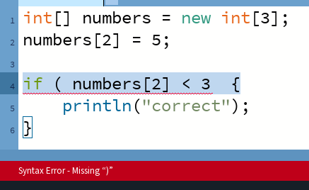
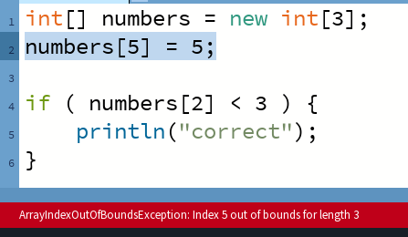

<h1>Chapter 12: Fixing Errors</h1>

In this chapter, we'll be looking at what to do to fix errors in your code!

<h2 id="types_of_error">Types of Error</h2>
As a bit of background, it's good to know about the types of error you'll run into, of which there are three main types:

<ul>
<li>Logical Errors</li>
<li>Compiler Errors</li>
<li>Runtime Errors</li>
</ul>

Each type of error is fixed in a different way, which requires us to have a different approach to "debugging".

<h2 id="logical_errors">Logical Errors</h2>
Logical errors are simply what we call problems where the program doesn't run as we expect it to. So our game logic is incorrect.
In these circumstances, we simply need to look in our code for the point where the program moves away from what we expect. For example, let's say that we wanted the word "correct" to be printed out if the 3rd element of an integer array was greater than 3, but it isn't, depsite it being 5, we can look at our code: 

int[] numbers = new int[3];
numbers[2] = 5;

if ( numbers[2] < 3 ) {
    println("correct");
}


We can look at the line of code where we test if numbers[2] is greater than 3, as this is the test that we know should be passing, but isn't. In this example, we've got the comparison the wrong way round, and have used < instead of >. If we change the inside of the if statement to instead read "numbers[2].x > 3", then the code will run as expected.

<h2 id="compiler_errors">Compiler Errors</h2>
The next type of error you'll likely face is the compiler error. These are errors that the `compiler` can see will be a problem, ahead of running the program. The compiler is the system that actual puts together all of the code into a format that the computer can understand, so if it sees issues, such as a missing semicolon, it can tell us before running the program that it isn't correct.

In these cases, the console will show us an error code, which will generally be fairly understandable.
As an example, we might have similar code to before: 

int[] numbers = new int[3];
numbers[2] = 5;

if ( numbers[2] > 3  {
    println("correct");
}


If we try to run this code, we'll be presented with an error by Processing!

In the console, we are told their is a Syntax Error - Missing ")", and Processing has highlighted line 4 for us.

As we would then expect, we can see that there is a missing ")" on line 4, after the 3, changing the code to fix this removes the error!

<h2 id="Runtime_errors">Runtime Errors</h2>
Runtime errors are then errors where the program fails as a point when it is running. These are more than just unintended behaviour like logical errors, and instead are more close to the type of failures seen with compiler errors.

If we again look at a similar example: 

int[] numbers = new int[3];
numbers[5] = 5;

if ( numbers[2] > 3 ) {
println("correct");
}


If we copy and paste this code into Processing, no immediate compiler errors are found, but when we try to run the program, it crashes!

Again we are presented with an error in the console and a highlighted line of code.
The console this time is telling us that there is an "ArrayIndexOutOfBoundsException", and that it found "Index 5 out of bounds for length 3". This is trying to tell us that we're accessing the 5th element of an array that is only 3 elements long, which we can see is true in the code. The numbers array is created with only 3 elements, and we immediately then try to use element 5. To fix this, we can either increase the size of the array, or change which element we're accessing, which in this case is the fix we want.

<h2 id="finding_the_offending_line">Finding the Offending Line</h2>
Sometimes, the line of code that we're told has an issue isn't quite the line of code that we want to change.
For  Compiler errors, this may be as simple as looking at the line above or below for where we want to add a missing bracket. But for runtime errors, this can be a little more tricky. If we consider again the last example where we are wanting to access the fifth element of an array that is only three long- It could be the case that at that point in the program we actually did expect the array to be five elements long. So we would have to instead find the line of code where we set the size of the array and make sure that it's correct.
A useful way to do this is by making use of the in-built debugger, where you can track the values of variables through different breakpoints in your code. Alternatively, for fairly straightforward problems, it's often very useful to just use the println command to print out some relevant information at different points in your code!

 

  <video width="600" controls style="max-width: 100%;">
    <source src="{{ site.baseurl }}/Videos/FixingErrors.mp4" type="video/mp4">
    Your browser does not support the video tag.
  </video>

 

 
<h2>Summary</h2>
When writing code it's always going to be the case that we run into errors. By understanding what they are and how to find what's gone wrong, we can figure out how to fix them!

For a list of common errors and what they mean, make sure to look at the <a href="../QuickReference/errors">quick reference here</a>!

<h2>More Help</h2>
<ul>
    <li><h3><a href="https://youtu.be/4JzDttgdILQ?si=BWjd9GVJ7mPTdG6E&t=2547">An intro to errors</a></h3></li>
</ul>

<a href="./conclusion">Conclusion >></a>

 
 
 

	