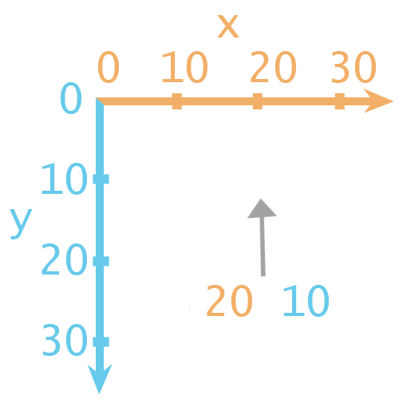
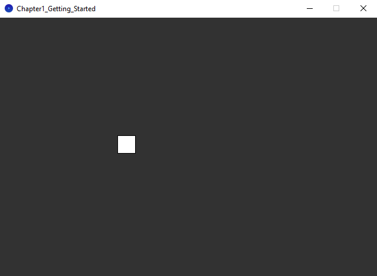
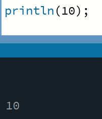

<h1>Chapter 1: Getting Started</h1>

In this chapter, we'll be covering how to get started using <a href="https://processing.org/">Processing</a>.
 
For a quick reference on the core Processing commands we'll be using, <a href="../QuickReference/processing">click here</a>.

<h2>Processing</h2>
Processing is an integraded development environment (IDE) that allows us to write code in the Java programming language. It includes some custom functionality that means we can draw and animate to a canvas, and some things to make coding a little easier in places.

To get started, you'll need to make sure you have Processing downloaded and running. If you don't already have Processing, follow the steps below, or watch along with the quick setup video!
<ul>
<li>Download the latest version of Processing <a href="https://processing.org/download">here</a></li>
<li>Unzip the file you downloaded, and place the folder somewhere safe!</li>
<li>Look inside the folders for Processing.exe and double click it.</li>
</ul>

 

  <video width="600" controls style="max-width: 100%;">
    <source src="{{ site.baseurl }}/Videos/downloading_processing.mp4" type="video/mp4">
    Your browser does not support the video tag.
  </video>

 
<h2>Using Processing</h2>
Now that you've got Processing downloaded and running, give saving and loading a file a go, and hit play to see an empty project run! Watch the video below if you're unsure how to get started.

 

  <video width="600" controls style="max-width: 100%;">
    <source src="{{ site.baseurl }}/Videos/using_processing.mp4" type="video/mp4">
    Your browser does not support the video tag.
  </video>

 
<h2>Writing Code</h2>
We're going to write some simple code to get used to using Processing, and build up the start of a simple game of Snake.
Copy and paste the code below into Processing and run it by pressing the play button.


//setup
size(200,300);

//draw background
background(0);

println(10);

This should create a canvas a little larger than you had before, with a black background.
 
Press the stop button back in Processing and the canvas should disappear.
 
The code above makes use of a few things that we'll make a lot of use of.
<blockquote>
//Comments - Using a double forward slash // on a line will allow you to write a comment from that point onwards. Comments won't be run as if they were code, and will mean you can look back at your code later and understand it more easily!
</blockquote>
 
<blockquote>
Semi-colons; - Semi-colons tell a line of code that it is complete. There will be times when we don't need them, but we can worry about that later, for now- make sure to end each line of code with a semi-colon.
</blockquote>
 
<blockquote>
Methods() - size(200,300) and background(0), are examples of methods. Methods run code that has been written somewhere else.
</blockquote>
 

We'll come back to methods in Chapter 3, so don't worry too much about them for now. These methods are also very Processing specific, but it's worthwhile understanding what each one does, and what each number we're putting inside the brackets means.

`size(200,300);` - Runs code to set the size of the canvas. The two numbers inside the brackets are the width and height of the resulting canvas.
 

<h3>Quick Task</h3>
<blockquote>
Change the code, so that the size command uses 640 as the width, and 440 as the height. When you run the program, the canvas should be a fair bit bigger.
</blockquote>

 
`background(0);` - Runs code to fill the canvas with a colour, making a fresh background. The number inside the brackets is the colour of the background, where 0 is black, and 255 is white.
 

 

<h3>Quick Task</h3>
<blockquote>
Change the code, so that the colour value passed in to the background method is 50. When you run the program, the canvas should be dark grey instead of black.
</blockquote>

 
The official Processing reference goes into much more detail on the methods built into Processing, so make sure to check that out if you're interested. This course will use them sparingly, so don't feel like you have to learn them all.

 
<h2><a href="../Extras/Brackets">( New Bracket Unlocked! )</a></h2>
<blockquote>
There are a lot of brackets used in programming, so each time we cover a new type, we'll make sure to understand what they actually mean. Our first bracket type is the round bracket. When you need to `pass information` into something, this is when you'll need round brackets (like this!). That's why when we wrote methods for setting the size and colour of the canvas in the previous example, we passed information into those methods, using round brackets!
To learn more, take a look at the quick reference page on brackets <a href="../Extras/Brackets">here</a>!
</blockquote>

 

  <video width="600" controls style="max-width: 100%;">
    <source src="{{ site.baseurl }}/Videos/getting_started.mp4" type="video/mp4">
    Your browser does not support the video tag.
  </video>

 
<h2>Drawing Shapes</h2>
Processing has methods for drawing many different shapes to the canvas, but we'll just be using rectangles to keep things simple.

Paste the code below into your program, after the code you've already got, then hit play.

//draw snake
rect(0,0,60,30);


As the comment suggests, this is the start of drawing the snake in our snake game. You should see a rectangle drawn in the top left corner of the canvas.
`rect` is another method, which this time takes four numbers as input, and draws a rectangle based on those numbers. The four numbers are the `x` and `y` coordinates of the top-left corner of the rectangle, and the `width` and `height` in pixels.

This means that our rectangle was drawn with its top-left corner at the coordinates 0,0 and was drawn with a width of 60 pixels, and a height of 30 pixels.

<h3>Coordinates</h3>
Based on where the rectangle was drawn, we can understand that an `x` and `y` position of 0,0 must be in the top-left corner of the canvas. When drawing shapes in Processing, it's important to remember that `x` values increase as we move `right` along the canvas, and `y` values increase as we move `down` the canvas, as shown in the image below.

<h3>Quick Task</h3>
<blockquote>
Change the values in the rect command so that the rectangle is drawn at coordinates 200,200 with a width and height of 30 pixels.

Your program should look like this:

</blockquote>

 

  <video width="600" controls style="max-width: 100%;">
    <source src="{{ site.baseurl }}/Videos/drawing_shapes.mp4" type="video/mp4">
    Your browser does not support the video tag.
  </video>

 
<h2>Colour</h2>
It would be nice to colour the rectangle green so that it fits the standard colour scheme of snake. To do this, just before the line of code where we draw the rectangle, on a new line, add the code below:

fill(0,255,0);


All of your code together, should look like this:

//setup
size(200,300);

//draw background
background(0);

//draw snake
fill(0, 255,0);
rect(200,200,30,30);


The `fill` method takes three values, these are the `red`, `green` and `blue` values, or `RGB` values.

Just like before, each colour value can be between 0 and 255, representing how strong each colour channel is. This means that when we enter 0 for red, 255 for green, and 0 for blue, we're telling the system that the fill colour should be all green, with no other colour.

Have a play about with the colour picker at the link below to see how to create some different colours using RGB, or choose a new colour for your snake.

<a href="https://rgbcolorpicker.com/" target="_blank" rel="noopener noreferrer">RGB Colour Picker (Opens in new tab)</a>

<h3>Quick Task</h3>
<blockquote>
Using the colour picker above, have a look at the RGB values for black, white, and some different shades of grey.
<ul>
<li>Why might the background method allow you to only provide one number?</li>
</ul>
</blockquote>

 

  <video width="600" controls style="max-width: 100%;">
    <source src="{{ site.baseurl }}/Videos/colours.mp4" type="video/mp4">
    Your browser does not support the video tag.
  </video>

<h3>Quick Task</h3>
<blockquote>
In snake, the player progresses by eating apples, so let's draw one!
Add another rectangle with a width and height of 30 pixels, positioned at 400,200. Colour this red.
</blockquote>

 
<h2>Quick check!</h2>
Before you move on, let's have a quick check that you've got everything so far!

    <h3>Which of the following lines of code would set the size of the canvas, with a width of 500, and a height of 300?</h3>
    <form id="quizForm">
        <input type="radio" id="option1" name="answer" value="A" data-feedback="That's not quite right, this line of code has got the width and height the wrong way round!">
        <label for="option1">size(300,500);</label> 
        <input type="radio" id="option2" name="answer" value="B" data-feedback="That's not quite right, this line of code doesn't only passes in one value!">
        <label for="option2">size(300);</label> 
        <input type="radio" id="option3" name="answer" value="C" data-feedback="That's not quite right, this isn't how we tell a method to run.">
        <label for="option3">size = (500,300);</label> 
        <input type="radio" id="option4" name="answer" value="D" data-feedback="That's correct! This line of code would correctly set the size of the canvas, with a width of 500 and a height of 300.">
        <label for="option4">size(500,300);</label>  
        <button type="button" onclick="checkAnswer('.question1container')">Submit</button>

    </form>

    <h3>How would you write a single line comment in Java?</h3>
    <form id="quizForm">
        <input type="radio" id="option1" name="answer" value="A" data-feedback="That's correct! A double forward slash at any point will turn the rest of the line into a comment that won't be run as code.">
        <label for="option1">//Like this</label> 
        <input type="radio" id="option2" name="answer" value="B" data-feedback="Technically this would work, but it's not quite right, as you don't need to use four forward slashes!">
        <label for="option2">////Like this</label> 
        <input type="radio" id="option3" name="answer" value="C" data-feedback="Technically this would work, but that's because wrapping text in /* */ is the format for a multi-line comment!">
        <label for="option3">/*Like this*/</label> 
        <input type="radio" id="option4" name="answer" value="D" data-feedback="Technically this would work, but it's not quite right, as you don't need to close your comment with forward slashes!">
        <label for="option4">//Like this//</label>  
        <button type="button" onclick="checkAnswer('.question2container')">Submit</button>
  

    </form>

    <h3>What are round brackets (like these) generally used for when programming?</h3>
    <form id="quizForm">
        <input type="radio" id="option1" name="answer" value="A" data-feedback="That's not quite right, although adding additional information in the same way that you do in writing is quite close!">
        <label for="option1">Referencing the author</label> 
        <input type="radio" id="option2" name="answer" value="B" data-feedback="That's correct! Round brackets are generally used to pass information into a method (or similar!).">
        <label for="option2">Passing information</label> 
        <input type="radio" id="option3" name="answer" value="C" data-feedback="That's not quite right, whilst we did use the size method, which did have round brackets, theyre used in many more places than that!">
        <label for="option3">Setting the size of the canvas</label> 
        <input type="radio" id="option4" name="answer" value="D" data-feedback="That's not quite right, we've not covered getting information from elsewhere yet!">
        <label for="option4">Getting information</label>  
        <button type="button" onclick="checkAnswer('.question3container')">Submit</button>
  

    </form>

 
<h2>Printing to the Console</h2>
It can sometimes be handy to print values to the console (the section at the bottom of the Processing window). To do this, we're going to use another method, called `println`, which is short for "print line". Paste the code below into Processing, and hit play.

 

println(10);

You should see that the number 10 has printed out in the console!

 
<h3>Careful!</h3>
<blockquote>
Don't forget, the println method is short for "print line", so the last two letters are LN, not IN.
</blockquote>

 
 
<h2 id="snake_video">Snake Game: Part 1</h2>
This video finishes up the first section of the snake game, adding an apple to the program using the fill and rect method calls.

  <video width="600" controls style="max-width: 100%;">
    <source src="{{ site.baseurl }}/Videos/SnakeChapter1.mp4" type="video/mp4">
    Your browser does not support the video tag.
  </video>

 
<h2>Summary</h2>
And that's us started! You should now be ready to move on to Chapter 2! Make sure to refer back to the <a href="../QuickReference/processing">quick reference for this chapter here</a>, and feel free to explore some questions if you'd like to learn more, in the Explore section below!

 
<h2>Explore</h2>
<ul>
    <li><h3><a href="../Extras/Data_Types">Why do colour values go up to 255?</a></h3></li>
</ul>

<a href="./variables">Chapter 2 >></a>

 
 
 

	